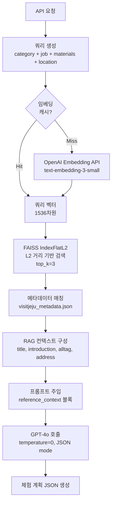

# Wadeulwadeul Heroes Backend

> 시니어가 운영하는 원데이 클래스와 LLM 기반 체험 기획을 제공하는 FastAPI 백엔드입니다.
- gpt-4o로 체험 기획 템플릿, 재료/단계 추천을 생성
- 선택적 RAG(visitjeju 데이터 FAISS 인덱스) 컨텍스트 주입, 실패 시 자동 폴백
- OLD/ YOUNG 역할 기반 클래스 생성·수정·신청 흐름

## 기술 스택
- Python 3.13, FastAPI, SQLAlchemy(Async)
- OpenAI API (gpt-4o, text-embedding-3-small), FAISS
- 패키지/실행: uv, Uvicorn
- 품질: Ruff, Pytest

## 주요 폴더
```
app/
  main.py
  api/routes/{health,heroes,users,classes,experience_plan}.py
  core/{config,database,auth}.py
  libs/openai_client.py
  models/{user,class_,enrollment,hero}.py
  prompts/*.py
llm/              # RAG 인덱스, 검색 유틸
k8s/backend/*.yaml
tests/*.py
scripts/ci-checks.sh
Dockerfile, plan.md, AGENTS.md, pyproject.toml
```

## RAG 파이프라인 아키텍처


**핵심 기술 포인트:**
- **임베딩 캐시**: 자주 사용되는 쿼리 임베딩을 로컬 캐시하여 API 호출 최소화
- **FAISS L2 검색**: visitjeju 데이터셋 기반 유사도 검색 (L2 distance)
- **폴백 메커니즘**: RAG 실패 시 기본 프롬프트로 자동 전환

## 빠른 시작
1) 요구 사항: Python 3.13, `uv`, `OPENAI_API_KEY`  
   - RAG을 쓰려면 `llm/output/visitjeju_faiss.index`, `llm/output/visitjeju_metadata.json`이 필요합니다. 없으면 기본 프롬프트로만 동작합니다.
2) 의존성 설치: `uv sync`
3) 실행:  
   ```bash
   OPENAI_API_KEY=... uv run uvicorn app.main:app --reload
   ```
   - 로컬(`ENVIRONMENT=local`)은 SQLite `wadeulwadeul_local.db`를 사용합니다.
   - 프로덕션(`ENVIRONMENT=production`)에서는 `DB_HOST/DB_USER/DB_PASSWORD/DB_NAME` 등으로 PostgreSQL을 설정하세요.
4) 문서: `http://localhost:8000/api/docs` (`/api/redoc`, `/api/openapi.json`도 제공)

## 환경 변수
- `OPENAI_API_KEY` (필수): OpenAI Chat/Embedding 키
- `ENVIRONMENT` (기본 local): production일 때 PostgreSQL URL을 조립
- `DB_HOST`, `DB_PORT`, `DB_USER`, `DB_PASSWORD`, `DB_NAME`, `DB_ECHO` 등: prod용 DB 설정
- `docs_url`, `redoc_url`, `openapi_url`은 `app/core/config.py` 기본값(`/api/...`)을 사용

## 인증
- 헤더 `wadeulwadeul-user: <user-uuid>` 로 사용자 UUID를 전달합니다.
- 미들웨어가 UUID를 DB에서 조회해 `request.state.user`에 저장합니다.
- 일부 엔드포인트는 선택적(auth optional), 클래스/신청/내 정보 조회는 필수입니다.

## API 요약
### 헬스체크
- `GET /api/health/ping` (200 반환)

### LLM 기반 체험 기획 (모델: gpt-4o, temperature 0)
- `POST /api/v1/experience-plan`  
  - 요청: `category`, `years_of_experience`, `job_description`, `materials`, `location`, `duration_minutes`, `capacity`, `price_per_person` (문자열)  
  - 응답: JSON 템플릿(체험 제목/소개/난이도/로드맵/오프닝/준비 단계/핵심 체험/마무리/준비물/특별 안내사항)  
  - RAG retriever가 주입되면 `<reference_context>...</reference_context>` 블록이 메시지에 추가됩니다.
- `POST /api/v1/experience-plan/materials-suggestion`  
  - 요청: `category`, `years_of_experience`, `job_description`  
  - 응답: `{"suggestion": "<재료 추천 텍스트>"}`
- `POST /api/v1/experience-plan/steps-suggestion`  
  - 요청: `category`, `years_of_experience`, `job_description`, `materials`  
  - 응답: `{"suggestion": "<단계별 안내 텍스트>"}`
- RAG 로딩 실패나 예외 발생 시 컨텍스트 없이 기본 프롬프트로 동작합니다.

### 클래스/신청 (역할 기반)
- `POST /api/v1/classes` (OLD만) 원데이 클래스 생성
- `GET /api/v1/classes` (인증 필요) / `GET /api/v1/classes/public` (공개 목록)
- `GET /api/v1/classes/{id}` 단건 조회, `PUT`/`DELETE /api/v1/classes/{id}`는 생성자(OLD)만 허용
- `POST /api/v1/classes/{id}/enroll` (YOUNG만) 신청, 본인/중복 검사
- `GET /api/v1/classes/enrollments/me` 내 신청 목록
- `DELETE /api/v1/classes/enrollments/{id}` 내 신청 취소
- `GET /api/v1/classes/my-classes/enrollments` (OLD) 내가 만든 클래스들의 신청 현황 조회

### 사용자/샘플 리소스
- Users: `/api/v1/users` CRUD, `GET /api/v1/users/me`로 현재 사용자 확인
- Heroes: `/api/v1/heroes` CRUD (데모용)

## 테스트/품질
- 모든 테스트 실행: `uv run pytest`
- 린트/포맷: `uv run ruff check .` (필요 시 `ruff format`)

## Docker (선택)
```bash
docker build -t wadeulwadeul-heroes-be .
docker run -p 8000:8000 -e OPENAI_API_KEY=... wadeulwadeul-heroes-be
```
